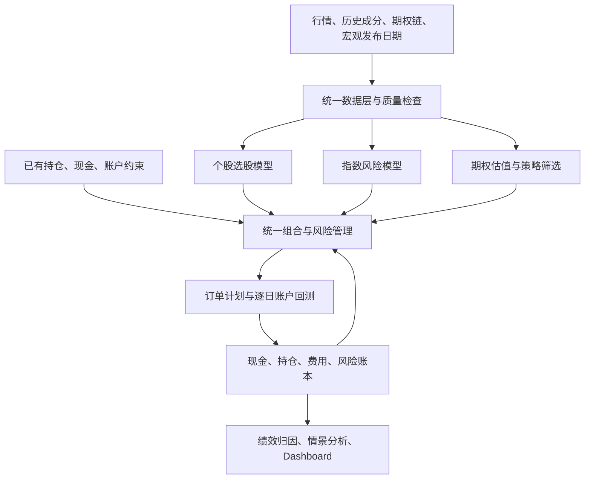

# QQQ、S&P 500、个股与 Put 研究系统改造设计

初稿：2026-09-06；本次完善：2026-09-08。版本：v0.2。状态：开发设计，新增能力尚未实现。

本方案依据当前仓库代码、`SESSION_NOTES.md` 的最新记录以及交易所、OIC 和数据供应商公开资料编写。本次目标是设计改造路径；没有训练新模型、验证策略收益或接入实盘账户。

本版确定接口、时间规则、资金口径和阶段验收；文中的默认值是可复现研究配置，不是用户的真实账户参数。第一项可交付成果为 **QQQ/SPY 持仓导入 → 持有/现金减仓对照 → 逐日账本 → 风险与净值报告**。固定保护性 Put 在期权数据及生命周期验收后接入。

阅读路径：第 3、4、6 节定义开发契约；第 7 节定义正确性与研究验收；第 8 节给出开发任务；第 9 节定义页面与输出；第 10 节列出默认配置及尚待确定的选择。

## 1. 系统目标与暂定范围

把现有 Nasdaq-100 选股示例升级为统一账户下的三个研究模块：

| 模块 | 需要回答的问题 | 主要输出 |
| --- | --- | --- |
| 个股选股 | 买哪些股票、配多少、何时换仓？ | 候选排名、目标持仓、换仓原因 |
| 指数风险与对冲 | 账户对 QQQ 和标普 500 暴露多少风险，需要减少多少？ | 目标风险敞口、减仓或对冲方案、成本 |
| Put 保护与交易 | 是否值得支付保险费、选择哪个合约、买多少、何时退出？ | 合约组合、权利金、情景损益、退出规则 |

三个模块共同使用一套持仓、现金和风险额度。系统同时支持“导入既有持仓后研究如何保护”和“从零构建模型组合”。

暂按美元计价的 ETF 加个股混合账户、中低频研究设计：股票周度决策，风险逐日检查，期权按预先定义的期限和事件管理。标普 500 的第一阶段可交易代理采用 SPY，指数本身及 SPX/XSP 合约另建标识。QQQ、SPY 的策略分别评估，再研究混合账户。

“做 Put”暂以买入保护性 Put 和独立看跌交易为主，同时设计现金担保卖 Put 的扩展接口。买卖 Put 的偏好、账户规模、已有仓位、风险预算和券商能力尚未确认，不能把下文研究参数当作个人仓位建议。历史记录中“期权后置”的安排不再排除本次期权系统设计。

## 2. 当前代码可以复用什么，需要改什么

| 当前实现 | 改造方向 |
| --- | --- |
| `examples/nasdaq100_medium_low_frequency.py` 集中采集、特征、训练、回测、报告 | 拆成可组合的研究应用；原示例保留为兼容入口和旧实验基线 |
| `download_market_data()` 将 QQQ 写死为唯一基准 | 支持多个市场、股票池和基准；区分指数、ETF、期权合约 |
| 17/37 维特征、Qlib LightGBM、MSE/LambdaRank、walk-forward、MLflow | 复用并参数化；选股、风险和期权分别使用适合其目标的数据集 |
| 历史成员文件仅在特征构造之后过滤，下载列表来自当前快照 | 从整个研究期间的历史成员并集下载数据；在当天横截面排名和标签计算前应用成员资格 |
| `run_weekly_backtest()` 用未来 5 日收益汇总组合盈亏 | 建立逐日、按事件推进的持仓账本；独立记录真实买卖金额、现金、费用、分红和期权变化 |
| 选股时会丢弃缺少 `forward_return` 的行 | 将可交易资格与未来收益数据分开，避免依赖未来能否取得价格来选择股票；退市另设清算事件 |
| 数据采用 `auto_adjust=True` | 保留复权序列用于特征，增加未复权成交价及公司行为账本用于交易和期权对齐 |
| `/api/prediction` 从静态 Dashboard 返回最近历史结果 | 分开历史研究结果、当前有效信号、待执行方案；当前信号不能要求已经有未来标签 |
| `lib/types.ts`、导出脚本含 `benchmark_qqq` 等固定字段 | 改为带版本的通用账户、策略、基准与期权数据协议 |

2026-09-08 代码核查补充：

- `main()` 在构造模型数据前执行 `dropna(target)`，当前样本外预测路径不能覆盖标签尚未成熟的最新日期；新推理入口必须直接消费特征表。
- `download_market_data()` 的缓存命中主要依赖文件存在；股票池、基准、日期及复权设置必须进入缓存标识，下载失败不能悄悄缩小研究股票池。
- 现有周度收益和 Dashboard 横轴使用 `signal_date`；完整持有期收益在退出前尚未实现，新版改为逐日估值，旧报告须标明收益覆盖的起止时间。
- `run_weekly_backtest()` 按成员集合变化估算换手，不能反映权重漂移及每笔买卖金额；新版成本从成交账本汇总。

仓库中已有 `scripts/data_collector/us_index/collector.py::SP500Index`，可作为标普历史成分变更的原型入口，但其网页解析和覆盖完整性需要验证，不能直接认定为权威、完整的历史时点数据。

当前股票多空回测还需要审计实际成交成本、漂移后的再平衡权重、空头借券费用、现金利息及逐日回撤。已有测试不能替代新账户与期权生命周期的验证。

## 3. 总体架构



Qlib 继续负责股票特征、模型接口、训练和实验记录。新增研究应用管理多资产账户、期权合约和事件回测。第一阶段采用一个 Python 应用加现有 Next.js Dashboard，文件产物和本地数据库即可；不需要先拆微服务。

模型提供预测和候选方案，组合管理器决定最终目标持仓。订单生成只发生在合并各模块意图、检查现金和风险之后，防止选股模块买入、对冲模块卖出同一风险而反复付费。

### 3.1 Qlib 与新应用的边界

继续复用 Qlib 模型接口、`LGBModel`、现有 `FrameDataset` 适配思路、滚动训练和 MLflow 记录；阶段 0 不要求先迁移全部行情到 Qlib 二进制格式。训练数据和模型适配器与账户实现之间只交换带版本的特征和信号。

Qlib 已有 `Account`、`Position`、`Exchange` 和 `SimulatorExecutor`，其中 `Position` 有现金延迟结算机制。新应用需要跨日期结算、分红应收、期权交割与可重放事件，不能仅改 instrument 名称就认为已经支持多资产。阶段 1 采用应用层账本作为唯一账户事实来源；Qlib 股票成交能力若通过适配器复用，只返回成交结果，不能与新账本分别更新同一份现金。复用时必须显式关闭不符合执行约定的回退，例如缺开盘价时改用收盘价。

### 3.2 模块输入输出契约

以下为待实现的内部接口；业务函数接收固定快照，不在计算中隐式下载数据或读取全局最新配置。

| 对象 / 接口 | 最小字段或行为 | 强制约束 |
| --- | --- | --- |
| `DataSnapshot` | `snapshot_id, manifest_hash, as_of, universe_id, tables, quality` | 同一快照不可覆盖；时点查询只返回当时可用版本 |
| `FeatureBatch` | `instrument_id, decision_time, feature_schema_id, values, eligible, reason_codes` | 不含未来标签；训练与推理使用同一特征契约 |
| `LabelBatch` | `instrument_id, decision_time, label_start, label_end, label_available_at, value` | 仅训练和评估依赖；与特征按键关联 |
| `SignalBatch` | `signal_id, strategy_id, generator_kind, generator_version, model_id, decision_time, valid_until, target_kind, horizon, scores` | 模型信号注明分数语义；规则信号可无分数，`model_id/horizon` 可为 `null` |
| `PortfolioIntent` | `intent_id, source_signal_id, target_positions / exposure_limit / protection_request, priority` | 模块提交目标或约束，不各自占用现金下单 |
| `OrderPlan` | `plan_id, plan_basis_hash, account_snapshot_ref, source_ids, orders, reservations, expires_at, reason_codes` | 整数数量、限价/价格上限、执行窗口、预计成本完整 |
| `AccountEvent` | `event_id, account_id, effective_at, available_at, applied_at, recorded_at, sequence, event_type, reference_id, payload_schema_version, payload` | 同一事件只应用一次；原始日志不覆盖 |
| `AccountSnapshot` | `state_hash, as_of, cash_buckets, receivables, payables, positions, marks, risk` | 从期初状态及事件日志重放得到 |

模型策略调用顺序为 `build_features(snapshot, as_of)` → `predict(features, model)` → `propose(signal, account)`；固定持有/减仓等规则策略通过 `propose_rule(config, account, snapshot)` 直接产生意图，保存规则版本，不依赖训练或模型文件。两者共用后续 `allocate(intents, account, risk)` → `simulate(plan, market_events)` → `apply(events)` → `report(account_history)`。只有训练流程额外调用 `build_labels`。

### 3.3 合并目标与不可行方案

固定优先顺序：到期/交割等账户义务 → 数据与工具限制 → 现金及风险硬约束 → 保护预算 → 选股目标。各策略的意图先净额合并，再做整股/整张取整和资金检查。规则及顺序进入配置版本，不按当天结果临时改变。

阶段 1 只需确定性的权重裁剪、现金预留与剩余现金处理，不引入通用优化器。以后引入优化器时仍使用同一契约：返回 `feasible`、约束偏离及未实现目标；不能把排名分数直接作为预期收益参与均值方差优化。

没有可行保护合约或整张取整超预算时，返回“本次无可行方案”和覆盖缺口；不自动超支、卖 Put 或新增杠杆。风险模型失效时采用事先声明的规则减仓基线；缺有效行情时不编造成交，保留持仓、标记估值质量并继续处理账户义务。

## 4. 数据层：先让历史实验可信

| 数据表 | 关键字段与用途 |
| --- | --- |
| `instrument_master` | 稳定 instrument_id、symbol 有效区间、类型、交易所、币种、交易日历 |
| `universe_membership` | index_id、instrument_id、announced_at、effective_from、effective_to、来源；统一为前闭后开区间 |
| `bars` | instrument_id、timestamp、available_at、原始 OHLCV、复权因子、来源 |
| `corporate_actions` | 分红、拆股、合并、退市、公告与生效时间；包含持仓清算规则 |
| `macro_vintages` | observation_date、released_at、available_at、vintage、value |
| `option_contracts` | underlying_id、上市时间、到期时间、最后交易时间、行权价、Call/Put、乘数、交割物、行权方式、结算方式 |
| `option_quotes` | quote_ts、available_at、contract_id、bid/ask、报价量、成交量、OI 及其可用时间、同步标的价格、IV/Greeks 和计算版本 |
| `account_events` | 持仓、订单、成交、现金流、费用、分红、行权/指派、结算、外部入金出金 |

所有研究数据同时保留“事件发生时间”和“系统当时能够取得该数据的时间”。特征只消费 `available_at <= decision_time` 的信息。宏观数据需要发布日期和历史版本；FRED 默认查询反映今天所知的历史，ALFRED 可以取历史时点已知的版本。[FRED 时间版本说明](https://fred.stlouisfed.org/docs/api/fred/realtime_period.html)

数据获取采用分级方案：

1. 继续用现有股票缓存开发流程，QQQ/SPY ETF 风险研究可以独立启动。
2. Nasdaq-100/S&P 500 个股正式回测接入完整历史成分与退市行情；两池合并时去重，保留成员身份和行业。
3. 期权先获取 QQQ/SPY 小范围历史报价样本，核验字段、质量和时间对齐，再确定采购范围和供应商。

Cboe DataShop 的 Option Quotes 提供历史报价，IV/Greeks 和 OI 为可选字段；页面说明历史从 2012 年起，日文件通常在隔夜或次日交付。因此研究中要记录实际可用时间，不能仅按文件日期认为当日盘中已知。[Cboe 数据规格](https://datashop.cboe.com/option-quote-intervals)

ORATS 可作为候选适配器，其页面列明历史买卖报价和 Greeks，并指出部分近收盘数据在收盘前 14 分钟采样。不同供应商的“日线”不能直接视为同一时刻。[ORATS 数据说明](https://orats.com/data-api)

采购前检查目标标的、历史区间、退市合约、原始与平滑报价区别、指数授权和展示权限；本次未购买数据，也未验证上述供应商在本账户下的可用性。没有真实期权历史报价时，只能做明确标注的定价情景实验和系统测试，不能据此宣称策略具有历史收益优势。

### 4.1 时点查询与标签成熟

统一使用带时区 UTC 时间戳，保留 `exchange_session` 和来源时区。交易日、提前收盘、夏令时、最后交易时刻由对应产品日历生成，不用固定 UTC 小时或自然日加减替代。

| 时间字段 | 含义 | 用途 |
| --- | --- | --- |
| `event_time` / `quote_ts` | 经济事件或市场报价实际发生时刻 | 排列行情、执行和估值事件 |
| `published_at` | 来源首次发布这一版本的时间 | 识别修订和信息先后 |
| `available_at` | 按已声明数据渠道当时可消费的时间 | 策略、风险、训练输入的硬上界 |
| `ingested_at` | 本地实际下载入库时间 | 运行溯源，不能直接当作历史可用时间 |
| `revision_id` | 该记录的版本 | 时点查询选择当时已知的最新版本 |

历史回放的 `available_at` 来自可验证的发布记录或明确的交付延迟假设；缺少依据时标为 `availability_assumed`。不能把今天下载旧数据的时间塞进历史决策，也不能仅因记录日期相同就视为收盘前已知。ALFRED 的日期版本仍需与发布时刻或保守延迟规则结合。

股票信号默认在该交易日完整数据可用后生成，订单最早在其后的合格开盘执行。若数据在下一开盘后才到达，就顺延执行，不强行填入“次日开盘”。周度信号与风险逐日检查分别配置，遇假日按交易日历推进。

标签按预先声明的数据可用规则与交易日历，定义决策后第一个允许的入场时点至持有 H 个交易日后的退出时点，保存 `label_start/end`；标签窗口不随实际订单是否成交或账户是否有现金而改变。有分红、拆股时计算一致的持有期总回报，不直接用未经处理的原始价格比。`label_available_at` 至少晚于计算该标签所需的全部数据可用时点。每次训练只纳入已经成熟的标签，且排除与验证/测试标签区间重叠的训练样本。

### 4.2 特征、历史成员与缓存

处理顺序固定为：历史成员并集及持仓标的 → 含预热区间的行情 → 单证券时序特征 → 当日成员资格与数据资格 → 横截面排名 → 特征表；标签在独立流程中构造。退出指数的已有持仓仍保留估值、公司行为和退出所需行情，不能因不在候选池中就消失。

成员有效区间采用 `[effective_from, effective_to)`；现有双闭区间 CSV 必须通过显式适配器转换。未来已经公告但尚未生效的变更不能提前参与当日成员排名。模型的特征顺序、缺失值指示列、归一化状态和特征版本在训练时冻结，推理不得依据当前批次是否缺值临时增减列。

缓存键至少包含数据源、标的集合、基准、起止日期、频率、价格口径、公司行为版本及转换代码版本。分别配置 `market_feature_proxy`、`label_benchmark` 和 `report_benchmarks`，避免把 QQQ 改成 SPY 后仍复用旧标签或行情。

每个快照附 `manifest.json`：各表路径与内容 hash、请求范围、实际覆盖、失败标的、可用时间依据、供应商字段版本、转换版本、质量报告。写入新版本目录并在完整校验后发布；重跑不得覆盖已被实验引用的快照。研究文件采用 Parquet，运行元数据与事件账本采用本地 SQLite 单写者，Dashboard 读取导出的 JSON。

### 4.3 数据质量与可用能力

| 检查 | 失败行为 |
| --- | --- |
| 主键、时区、成员区间重叠、未知合约或交割物 | 停止该数据集进入正式实验，输出记录定位 |
| 下载缺标的、退市缺清算、成员覆盖不完整 | 保留原计划股票池与缺失清单；结果标为覆盖不完整，不静默剔除 |
| `bid < 0`、`ask < bid`、报价过期 | 不用于该决策或成交；记录原因 |
| 策略引用晚于决策或尚不可用的报价；执行引用订单窗口外报价 | 分别拒绝；执行可用订单生效后、窗口内的合格报价，不能反传此前决策 |
| 报价大小、同步标的价格、OI 可用时间或 Greeks 单位不清楚 | 禁用依赖该字段的容量/风险结论，不猜测单位 |
| 持仓估值缺失 | 使用已配置且有时效上限的回退，标记估值来源；无有效回退时 NAV 为不可用，不能删除该日期后计算收益 |

质量报告包含预期/实际交易日数、报价覆盖率、最大连续缺口、被拒执行次数、模型估值占比及受影响 NAV 比例。阈值在实验启动前冻结，不能观察策略成绩后放宽。

对不同能力分别给出状态：`prototype`（流程开发）、`historical_validated`（满足该实验所需历史数据与账本检查）、`signal_ready`（当前特征和模型时效合格）。合成期权价格只可标为 `scenario_only`。数据通过检查并不意味着策略有效。

Cboe 当前规格还披露了 2026-06-22 起报价数量采样口径变更，以及提前收盘日文件时间与实际行情时间的区别；适配器应记录这些版本边界，不把文件标签直接作为报价新鲜度或可成交量。[Cboe 报价规格](https://datashop.cboe.com/option-quote-intervals)

## 5. 三个研究模块

### 5.1 个股选股

支持 `nasdaq100`、`sp500`、去重后的联合股票池和用户持仓池。Nasdaq 模型用 QQQ 比较，标普模型用 SPY 比较；联合池配置单一明确基准或可解释的行业/市场残差标签，不混用不同标签后直接排序。

首轮复用 LightGBM，预测未来 5/20 个交易日相对基准的收益或排名。各预测周期独立训练，排名分数不能直接当作收益率或上涨概率。交易标签使用明确的可执行起止价格：例如 t 日收盘决策、t+1 日开盘买入、t+H+1 日开盘退出。

组合先实现 long_only：Top-K、持仓缓冲区、单股上限、行业偏离、成交额限制和现金下限。Top-K 和缓冲区是小规模预先声明的研究参数。原有美元中性模型保留为 Alpha 对照。

对照包括 ETF 持有、历史成分等权、简单动量选股、LightGBM 选股。评价成本后超额收益、信息比率、Rank IC、换手和跨年份稳定性。单只股票预测分数高，也需要通过账户集中度检查。

### 5.2 指数风险与对冲

风险模块使用按日期组织的市场时间序列，不能把当天 500 只股票复制出的同一指数标签当作 500 份独立训练样本。先实现趋势规则、滚动波动率和固定对冲比例基线，再比较简单统计模型与 LightGBM 风险模型。

预测目标包括未来 5/20 日实现波动率、下行收益分位数和预先定义阈值的下跌概率。概率要检查校准与样本外表现；股票相对收益模型不直接承担指数涨跌预测任务。

风险管理同时解决两个问题：

- **账户风险有多大**：ETF 持仓、个股、期权一起计算，展示对 SPY/QQQ 的敏感度和行业集中度。
- **怎样调整更合算**：比较减持到现金、固定比例对冲、波动率目标、规则动态对冲、模型动态对冲、Put 保护。

QQQ 和 SPY 的暴露有重叠。单独回归得到的两个 Beta 用于观察，不能直接相加或分别全额对冲。优化器用联合协方差或正则化多因子回归；也可用 SPY 因子加 QQQ 相对 SPY 的残差因子，降低重复计算和参数不稳定。

对冲决策目标为：在现金、成本和允许的工具范围内，使账户风险接近目标。Put 已经贡献的 Delta 必须先纳入计算，再确定额外 ETF 对冲量。风险变化和下单量设置阈值、迟滞与最短调整间隔，减少频繁反向操作。

首版联合因子采用 `r_QQQ = b × r_SPY + ε`，窗口仅使用决策前数据，保存 `b`、协方差、样本量和估计时点。`RiskSnapshot` 同时输出 SPY 因子和 QQQ 残差因子的美元暴露、净值占比、估计质量及 Greeks 时点。样本不足或估计不稳定时降级为直接 ETF 名义敞口和预设压力情景，不能把缺失 Beta 当作零。

第一阶段先实现现金减仓与股票/ETF 账户。卖空 ETF 作为后续独立能力，增加可借数量、借券费、融资和被迫平仓逻辑；股指期货、反向/杠杆 ETF 另设产品适配器，不能简单用指数收益乘负数代替可交易产品。

评价对冲应同时报告总收益、回撤、尾部损失、上涨参与率、保险/融资成本，并和现金减仓在相近风险水平下比较。风险下降但收益牺牲过多的方案不自动胜出。

### 5.3 Put 保护、看跌交易和卖 Put

| 策略 | 目的 | 系统必须记录 |
| --- | --- | --- |
| Protective Put | 给已有多头买保险 | 保护对象、覆盖程度、权利金预算、到期和滚动 |
| 独立 Long Put | 表达看跌观点 | 独立策略损益、最大权利金损失、到期与退出规则 |
| Bear Put Spread | 降低看跌组合的初始权利金 | 两腿成交、有限赔付、提前指派及剩余敞口 |
| Cash-Secured Put | 收权利金并愿意在行权价接股 | 现金占用、指派后持股、集中度和下行风险 |

买入 Put 的损益取决于价格、下跌幅度、发生时间、隐含波动率和时间损耗。“预测会跌”不等于 Put 交易有正期望。保护性 Put 的经济价值应在整个被保护账户上衡量，不能要求保险腿单独盈利。[OIC 保护性 Put](https://www.optionseducation.org/strategies/all-strategies/protective-put-married-put)

Bear Put Spread 用较低行权价的空头 Put 抵消部分成本，但期权组合的到期赔付有上限；标的跌破较低行权价后，保护组合中的股票仍继续下跌。因此界面不能把它显示为完整的尾部保底。[OIC Bear Put Spread](https://www.optionseducation.org/strategies/all-strategies/bear-put-spread)

卖 Put 在下跌时承担买入标的的义务，属于增加下行暴露的交易/接股策略；现金担保不消除股票下跌风险。该模块不计入“账户买入保险”，并要求指派资金不被其他策略重复占用。[OIC Cash-Secured Put](https://www.optionseducation.org/strategies/all-strategies/cash-secured-put)

期权筛选器输入为账户风险、同期合约链、可用现金和预算，输出合约、整数张数、净权利金、各情景损益、Delta/Gamma/Vega/Theta、平仓/滚动条件及被排除的候选原因。

首轮可预先挑选少量研究候选，例如 30/60/90 日期限，固定虚值程度或绝对 Delta 档位，以及不同年度权利金预算；分阶段比较，不做所有参数的穷举择优。年度预算同时记录累计买入权利金、卖出回收款、净现金支出和实际损益，防止来回滚动掩盖真实成本。

保护性 Put 与独立看跌 Put 使用独立的逻辑策略标签，但账户风险合并。对完全匹配标的、数量和交割物的股票加 Put 可以计算到期保护线；用 QQQ/SPY Put 保护个股篮子只能给出基差风险下的情景结果，不能承诺账户最大亏损被固定封顶。

阶段 2a 首先只做标准 QQQ/SPY 合约的固定保护性 Put。候选规则、目标期限、到期前退出窗口及保险预算在验证阶段冻结；没有合格合约可以保持未保护状态并披露缺口。`coverage` 分别报告名义覆盖、Delta 覆盖和压力情景损失，避免用一个百分比暗示完全保险。独立 Long Put、Bear Put Spread 和现金担保卖 Put 放入阶段 2b；其中带空腿的策略必须先通过指派与现金占用验收。

## 6. 合约规则与账户回测

QQQ/SPY 常规 ETF 期权采用美式行权和实物交割；SPX/XSP 是不同的指数期权产品，采用欧式行权和现金结算。合约元数据应分别保存行权、交割、乘数和具体结算时刻；调整合约不能一律假设交割 100 股。第一批研究用 QQQ/SPY Put，SPX/XSP 在合同规则和数据就绪后比较。[Cboe 期权类型说明](https://optionsfacts.cboe.com/) [Cboe 产品比较](https://www.cboe.com/tradable_products/product_comparison/)

### 6.1 时间与执行

回测推进为：市场/公司行为事件 → 处理已有订单与成交 → 更新现金和持仓 → 按当时可用数据估值 → 决策 → 检查风险与资金 → 生成后续订单。

决策回放按 `process_at = max(effective_at, available_at)` 排列事件，再以版本化优先级和来源稳定顺序打破同刻并列；应用后记录单调递增的 `sequence`。每个交易日先处理应在开盘前生效且已知的拆股、分红资格和结算，再执行此前生成且仍有效的订单；收盘后先完成估值和已到达数据更新，再产生新决策。期权最后交易、行权截止、通知和交割按各自时间入队，不能统一挤到股票收盘事件。

股票可沿用收盘决策、下一开盘成交的规则。期权若只有日末报价，默认 t 日数据可用后决策、在后续有效快照模拟执行；不能用 t 日收盘信号搭配 t 日较早的期权报价。只有具备执行时刻的历史报价时，才能研究“次日开盘附近成交”。

委托的合约选择和触发条件必须事先规定，实际报价只用于合法的执行检查。缺报价、过期报价、价差过宽或资金不足可以不成交。组合订单需要描述整组执行或分腿执行，不能假定所有腿同时以理想价格成交。

策略查询与成交回放使用不同视图：策略只能读取当时 `available_at` 合格的数据；撮合器可以用订单生效后的历史市场报价判断预先固定的委托是否可能成交，但不能把该报价反传给更早的选股、合约选择或下单数量计算。来源若只支持区间快照，成交结果须标为快照撮合假设，不能声称还原了真实排队成交。

订单状态至少包括 `PLANNED → RESERVED → SUBMITTED → PARTIALLY_FILLED / FILLED`，以及 `REJECTED / CANCELLED / EXPIRED` 终态。成交数量累积不能超过委托数量，终态不再成交；撤单与成交的先后由事件顺序决定。部分成交释放已消耗部分预留，保留剩余订单所需资金；到期/撤单释放剩余预留。重试通过稳定的 `client_order_id` 去重。

`OrderPlan` 固定整数股/张、`not_before`、`expires_at`、限价或最大支出以及资金来源；成交价格只用于检验这些条件。若开盘跳空导致资金不足，首版拒绝该买单并等待下次决策，不能以已知开盘价事后重新优化目标。现金减仓得到的未结算款也不能立即当作已结算现金使用。不同策略相反意图按净额成交，并保存内部持仓分配及一致的费用归属规则。

### 6.2 现金、估值和成本

账户净值采用现金加各持仓的带符号市值；期权使用合约数量乘合约乘数再乘报价。买 Put 支付权利金时同时获得期权资产，不能在现金中扣一次、组合收益里再扣一次；卖 Put 收到现金时同时增加负债，不能立刻把全额权利金当成利润。

账本使用成交日确认、结算日划款的口径：

```text
NAV = C_settled + AR_trade + AR_dividend - AP_trade - AP_other
      + sum(signed_quantity × price_multiplier × mark)

available_cash = max(0, C_settled - AP_trade - AP_other
                       - R_open_orders - C_collateral - C_minimum)
```

`AR` 是应收、`AP` 是应付，均为非负金额；费用进入应付或已结算现金支出且只记录一次。`R_open_orders` 为未成交订单预留，`C_collateral` 为持仓占用；预留只是购买力约束，不从 NAV 再扣一次。买入成交将相应预留转换为应付，结算冲减现金与应付；卖出先形成应收，收款再增加已结算现金。现金担保卖 Put 的未成交预留在成交后转换为担保占用，避免占用两遍。所有未到期义务都必须被覆盖，公式中的 `max` 不能掩盖现金覆盖不足事件。

卖 Put 被指派时，在同一事务中将对应 `C_collateral` 转换为交割 `AP_trade`，不重复占用现金；未被指派部分保留担保。O02 案例在指派确认后、结算前为现金 10,200、股票市值 9,000、应付 9,500、担保占用 0，可用现金 700，NAV 9,700。

首版为无融资现金账户，保守地只使用已结算可用资金；这属于研究执行假设，并不代表所有券商的购买力规则。美股及 ETF 适用交易自 2024-05-28 起标准结算缩短为 T+1；历史回测必须按成交日期选择当时规则，不能把今天的周期套到整个样本。更早时期、期权交易及行权交割分别维护生效日期和结算日历；尚未配置的区间应拒绝运行。[SEC 结算说明](https://www.investor.gov/introduction-investing/general-resources/news-alerts/alerts-bulletins/investor-bulletins/new-t1-settlement-cycle-what-investors-need-know-investor-bulletin)

未复权价格用于成交，分红与拆股作为事件处理，避免复权收益与现金分红重复计入。现金利息采用明确的历史利率和日计数假设；国债收益率代理不等于实际账户获得的总回报。融资利率与现金收入利率分别配置。

普通现金分红在权利生效时确认应收，支付日转入现金；资格按公司行为和结算规则判定。特殊分红、拆股和调整合约使用独立事件及版本化交割物，不用固定乘数替代实际交割义务。`price_multiplier`（报价金额换算）与 `deliverable`（股票/现金交割物）分开存储。

金额、成交数量及费用以十进制定点数或 Decimal 记账，按币种和费用规则舍入；模型、估值和风险统计可用浮点数，账本核对误差容限需显式配置。期初导入必须包含现金、实际股数、估值时点和所有未结算义务；仅有当前持仓时，从该时点开始模拟，不倒推虚构过去账户收益。

股票费用按实际买卖名义金额逐边计算，并处理持仓漂移后的再平衡。期权买入以 ask、卖出以 bid 作为保守报价基线，再计佣金和额外滑点；中间价只能作为另一个明确假设的敏感性实验。成交量和 OI 不被当作保证能够成交的凭据。

缺失报价不能填零或无限沿用旧价。估值允许有时效上限、带来源标记的回退和模型估值，执行仍要求合格报价；数据质量不足的区间降低结果可信等级。实际历史报价用于主回测，定价模型主要用于情景分析、Greeks 和有限估值回退。

成交前后核对采用净值调节式，而不是要求扣费后 NAV 不变。以同一组估值价计算：`ΔNAV = Σ[signed_fill_quantity × price_multiplier × (mark - fill_price)] - fees`，成交数量买入为正、卖出为负，另列期间价格变化和外部现金流。默认期权会计估值用合格 mid，同时展示多头按 bid、空头按 ask 的平仓价值；期权价差和佣金造成的即时净值下降应能逐项解释。

### 6.3 期权生命周期

必须处理上市、到期、最后交易日、合约调整、行权/指派、交割和现金结算；美式合约的估值模型考虑提前行权与分红。即使策略计划提前平仓，也需要处理缺报价导致未平仓的情形。

买入 Put 行权需要检查可交付标的。单独看跌 Put 若没有相应股票，不得无声地生成账户不允许的空头；应按事先规定的卖出、放弃行权或券商处理情景记录结果。卖 Put 和价差空腿还需要指派与资金压力场景。

生命周期账本至少包含 `ACTIVE → CLOSE_PENDING / EXERCISE_PENDING / ASSIGNMENT_PENDING → SETTLEMENT_PENDING → CLOSED`；关闭交易也可能有待结算款。行权/指派时注销期权、确认交割证券与应收应付，结算只清偿义务，不能再次确认同一份内在价值收益。

到期规则保存 `last_trade_at, exercise_cutoff, exercise_policy, settlement_at`，并区分来源规则和研究假设。OCC 的到期例外行权程序与客户券商实际处理不完全相同，不能硬编码“所有价内 Put 自动现金到账”。提前行权模型只是一种模拟假设；带空腿的实验必须另做提前指派和无法平仓的压力回放。[OIC 行权说明](https://www.optionseducation.org/referencelibrary/faq/options-exercise) [OIC 指派说明](https://www.optionseducation.org/referencelibrary/faq/options-assignment)

### 6.4 风险与归因

每次估值计算账户净值、可用/预留现金、总/净股票敞口、因子暴露、期权 Greeks、按策略分解的损益，以及完整重估的压力情景。

`数量 × 乘数 × Delta × 标的价格` 表示期权对其标的的一阶美元敏感度；换算到账户共同因子时还需标的的因子暴露。Delta 对冲只描述局部价格变化，不能代替暴跌情景。

情景至少包含指数下跌、QQQ 相对 SPY 额外下跌、IV 上升或下降、时间推进、隔夜跳空、价差扩大和一条腿无法平仓。较大变动用适当期权模型完整重估，不只依赖 Delta 线性外推。

损益分解为 ETF/个股、线性对冲、期权、现金利息、融资和费用；Greeks 解释作为近似归因，保留重估残差。逻辑策略分别记账，但实际成交前净额合并。

Greeks 统一注明单位，例如 Delta 按每股、Vega 按波动率变动 1 个百分点、Theta 按一个自然日；供应商单位先转换再聚合。情景输出注明参考时点、标的/IV/时间冲击和估值模型版本；参数无法识别时输出缺失状态，不能默认为风险为零。

### 6.5 持久化、恢复与对账

事件、现金变化、持仓变化及预留转换在同一个本地事务内提交。`event_id` 唯一，重复导入忽略并记录；纠错新增反向/更正事件，不改写既有成交。`applied_at` 记录运行时钟上的实际应用时间，快照保存最后应用序号、配置版本及状态 hash；完整决策回放与恢复均按同一持久化应用序列推进。

`effective_at` 表示经济归属时间，`available_at` 表示账户通知当时可见的时间，`recorded_at` 是本地持久化时间。决策使用当时可见的账户事件；迟到的成交/指派通知和更正追加到当前应用序列，不插入已完成的决策回放。需要按经济日期修订历史净值时，从受影响日期之前重新计算并发布独立报告版本，不能复用该日期之后的旧经济快照或反向改变历史决策。报告区分重述净值与当时决策所见账户状态。

导出报告先写临时目录，账本与文件检查通过后原子发布 `run_id`；前端只读取完整版本。保存运行状态 `created/running/completed/failed` 与失败阶段，失败运行不更新当前有效信号指针。外部净入金单列，收益使用剔除现金流的分段时间加权收益；投入 1,000 美元本身不能产生投资回报。

## 7. 实验设计与验收

先分别对 QQQ、SPY 做 ETF 实验，再加入模型个股组合。所有对照采用相同起点、初始资金、现金计息、税前口径和可比的执行假设。

| 实验组 | 对照关系 | 主要目的 |
| --- | --- | --- |
| A | ETF 持有、ETF 加现金 | 建立完整账户账本和风险水平基线 |
| B | 固定减仓、波动率目标、规则动态、模型动态 | 验证风险模型是否优于简单控制 |
| C | 无保护、固定规则 Put、Put Spread、择时 Put | 比较风险改善、保费和上涨机会成本 |
| D | 现金担保卖 Put、同资金现金/直接持股 | 如果用户需要，单独评估接股策略 |
| E | 等权/动量/LightGBM 个股组合及其保护版本 | 区分选股收益、市场收益和对冲贡献 |

模型与策略参数都只在训练/验证区间选择。时间切分按样本真实的 `label_start`、`label_end` 和数据可用时间排除重叠：5 日股票收益、20 日市场风险和更长期的期权交易不能统一套用 5 日 gap。每个 walk-forward 时点只使用已经成熟的标签；标准化、校准、特征选择也须在当时可用数据内拟合。

过去反复观察过的 2024–2026 结果作为开发记录，不能重新命名为全新封存测试。新测试区间在方案冻结后按数据可用性设定；2020、2022 等压力时期可用于开发和压力验证，但不能同时冒充未见样本。

主要评价为年化收益、最大回撤、预期短缺 ES、波动率、信息比率、上涨/下跌参与率、保险成本、周转和资金占用。报告同等风险下的收益比较、同等收益目标下的风险比较和不同预算的权衡。现金担保卖 Put 必须报告完整账户收益，不能只用权利金除保证金制造不可比的高收益率。

### 7.1 实验冻结与判断标准

每次正式比较先保存 `ExperimentSpec`：假设、股票池与基准、初始账户、数据快照、训练/验证/测试区间、标签成熟规则、主指标、参数搜索范围、成本场景、失败判据及已查看的区间。测试期打开后调整方案，必须登记为新实验，不能覆盖旧结果。

风险控制实验首轮主指标采用固定风险/保险预算下的逐日最大回撤及 95% 日损失 ES，同时报告总收益和上涨参与率；选股实验主指标采用相对基准的成本后信息比率，同时报告 Rank IC、换手和跨窗口表现。指标计算频率、现金流处理、年化约定和尾部样本数必须给出；观测不足不输出看似精确的 ES 排名。

“同等风险”通过训练/验证区间确定共同目标，再冻结到测试期；不能用测试期最终波动率倒算减仓比例。主报告展示实际达到的风险及偏离。区间比较保留共同日期，不能每个策略各自删除不利或缺数据日期；缺失不可估值时明确判定该区间不可完整比较。

新账本的收益按实际每日净值计算；阶段末默认持有并估值，另报按可平仓价及费用计算的清算价值。强制清仓作为独立配置，所有对照一致。跨年收益按估值日期归属，不把未来持有期收益提前到信号日。成本压力至少采用预先声明的基准费用及加倍费用；不得事后调整以改善结果。

验收分两层：**工程正确性必须通过；策略有效性允许结论为未优于基线。** 通过正确性验收才发布可比较回测，稳定运行或短期盈利本身不能替代研究证据。

必要验收：

- 数据：历史成员资格、发布日期、合约上市/退市和采样时间检查；不能依赖未来标签判断可交易性。
- 账本：每次事件前后净值变化可由成交价差、费用、估值变化及外部现金流解释；分红、拆股、权利金和交割可逐笔核对。
- 期权：价内/价外到期、美式指派、价差一腿指派、合约调整、缺报价、资金不足和整张取整案例通过。
- 风险：QQQ/SPY 重复暴露、Put 已有 Delta、最坏情景、现金担保不重复占用等案例通过。
- 实验：每个运行保存数据版本、配置、代码版本、模型版本、交易清单、成本假设和完整逐日净值。
- 模拟：同一份有效信号和配置可复现订单计划，记录未成交/部分成交；运行数月只验证运维稳定性，不单凭短期盈利证明策略有效。

### 7.2 最小验收案例

以下为待实现测试规格，不代表测试已经通过。金额示例均为美元；除特别说明外不计费用、税及利息，标的价格不发生额外变动。

| 编号 | 输入 / 场景 | 必须得到的结果 |
| --- | --- | --- |
| D01 | 固定训练好的模型，截断或扰动决策时点之后的数据；最新 H+1 日没有标签 | 此前特征、可交易资格和信号不变；最新合格特征仍可推理 |
| D02 | 报价 20:00 发生、20:05 可用；20:01 决策或训练 | 不可读取该报价或依赖该报价才成熟的标签 |
| D03 | 成员加入/退出边界、非成员增删、加入前已有预热行情 | 前闭后开区间正确；非成员不改变当日排名；新增成员可使用合法预热数据 |
| D04 | 同一输出根目录切换 QQQ/SPY、扩大日期或改复权设置 | 拒绝不匹配缓存或命中新版本；不能静默返回旧数据 |
| L01 | 现金 10,000，买 10 股、每股 100，费用 1 | 成交日 NAV 9,999；应付 1,001，持股市值 1,000；结算后现金 8,999，NAV 不再变化 |
| L02 | 100 股 × 100；普通每股分红 1，除息价 99；之后付款；另测 2:1 拆股 | 除息时市值 9,900 加应收 100；支付只转现金；拆股时 200 股 × 50 保持价值 |
| L03 | 初始现金 10,000，一张 Put，ask 5、mid 4.8、乘数 100、佣金 1 | 应付 501，期权市值 480，NAV 9,979；结算后现金 9,499；损失为价差 20 加费用 1 |
| L04 | 完整卖旧买新，卖出与买入名义各 10,000，单边费率 10 bps | 给定成交金额的费用合计 20。另测名单不变但权重漂移仍有实际换手 |
| L05 | 同一成交重复导入；中间快照恢复；外部入金 1,000 | 重复事件不改余额；恢复与全量回放一致；没有价格变化时入金对应投资收益 0% |
| O01 | 100 股、价格 90；一张行权价 100 的 Put，到期价值 1,000 | 行权前总值 10,000；交出 100 股、注销 Put、确认应收 10,000；不能额外再加 1,000 收益 |
| O02 | 现金 10,000，卖一张行权价 95、权利金 2 的 Put，乘数 100；到期标的 90 并指派 | 权利金结算后现金 10,200、初始期权负债 200，NAV 10,000；预留担保 9,500；指派结算后现金 700、100 股价值 9,000，NAV 9,700 |
| O03 | 预算低于一张 Put 成本；缺有效平仓价；独立 Put 缺交割标的；价差一腿指派 | 分别得到零张及原因、未成交与估值标记、显式到期处理、指派后真实敞口；不出现小数合约或理想化现金赔付 |
| R01 | SPY 50,000、QQQ 50,000，QQQ 的 SPY 因子系数 1.2；再加一张 QQQ Put，S=500、乘数 100、Delta=-0.4 | 原 SPY/残差因子美元暴露 110,000/50,000；Put 后为 86,000/30,000，不重复对冲 |
| E01 | 两策略分别买 10 股、卖 6 股同一标的；另测缺开盘价、部分成交、开盘跳空超预算 | 外部只净买 4 股；缺价不回退收盘；成交不超委托；资金预留正确；超预算买单拒绝 |
| P01 | 跨年持有期、失效信号、未完成运行、LambdaRank 模型 | 收益按估值日期入年；失效信号不返回可执行计划；不发布半成品；排名分数不显示为收益率 |

L04 只测给定成交金额的费用函数；完整账户另用充足已结算现金，或等卖款结算后再按费用调整买入数量，不能靠负现金完成换仓。

运行产物至少包含 `manifest.json`、冻结配置、模型与特征版本、事件日志、订单/成交、每日账户快照、风险快照、质量报告和结果。代码溯源保存 commit 与实际执行源码内容 hash；工作树有未提交/未跟踪代码时不能只记 commit。仅归档任务源码的明确清单，不打包 `.env`、密钥或整个工作区；另保存依赖版本及随机种子。

## 8. 建议目录与实施顺序

以下目录和接口为提案，尚未创建：

```text
apps/quant-research/
  quant_research/
    contracts.py   # 带版本的数据、信号、计划、事件契约
    config.py      # 配置校验、默认值、配置 hash
    data/          # 多基准行情、历史成员、期权、可用时间、质量报告
    features/      # 个股特征、市场特征、期权特征
    models/        # 选股排名、市场波动/下行风险
    strategies/    # stock_selection、hedge、protective_put、directional_put
    portfolio/     # 统一权重、现金预算、风险约束、订单净额合并
    backtest/      # 事件回放、成交、账户、期权生命周期
    risk/          # 因子暴露、Greeks、情景重估
    reporting/     # 绩效、归因、Dashboard v2 导出
    paper/         # 持仓导入、有效信号、订单计划、模拟成交
  configs/         # universe / account / model / strategy / execution
  tests/
```

按交付逐步创建目录，阶段 0/1 只需要 contracts、config、data、portfolio、backtest、risk、reporting 及已有模型的薄适配；期权和模拟服务随阶段启用。

| 阶段 | 具体交付 | 完成标准 |
| --- | --- | --- |
| 0：基础拆分 | 统一配置、QQQ/SPY、多资产 ID、数据版本、训练与推理分离、旧实验适配 | 原研究可追溯；当前特征不依赖未来标签；D01/D02/D04/P01 通过 |
| 1：ETF 账户与风险 | 初始持仓导入、逐日账本、QQQ/SPY 持有与减仓基线、联合暴露、情景页面 | L01/L02/L04/L05/E01 及 R01 无期权部分通过；离线完成端到端报告 |
| 2a：固定保护性 Put | 历史报价样本、标准合约主表、估值与生命周期、固定保护性 Put | L03/O01 及 O03 买方场景、完整 R01 通过；保费和覆盖缺口可解释 |
| 2b：其他 Put 策略 | 独立 Long Put、价差、按需要启用现金担保卖 Put | O02/O03 全部通过；真实报价及指派压力场景合格 |
| 3：模型与个股 | 历史成员股票池、long_only、基准相对标签、风险模型、择时 Put、统一资金配置 | 对照实验和跨窗口评估完整；没有混合不同口径择优 |
| 4：模拟运行 | 最新信号、组合计划、模拟成交、账户对账与监测 | 研究和模拟使用同一决策代码；成交差异可追踪 |

阶段 3 的个股 long_only 与风险模型只依赖阶段 1 和各自数据，可以独立推进；择时 Put 额外依赖阶段 2a。阶段 4 可先对已验收的 ETF 能力模拟运行，不必等待全部期权策略。阶段 2b 为可选扩展，不阻塞其他主线。

### 8.1 阶段 0/1 的开发任务

每行是一个独立可审查的开发单元，表中“验收”描述未来完成条件。

| 任务 | 主要修改位置 | 交付与验收 | 依赖 |
| --- | --- | --- | --- |
| S0-1 配置与快照 | 新应用 `contracts/config/data`；现有下载入口适配 | 参数校验、缓存 manifest、QQQ/SPY 切换、离线数据读取；D04 | 无 |
| S0-2 训练与推理拆分 | `_instrument_features/build_feature_frame/qlib_frame/main` 的应用适配 | 特征不依赖标签、固定 schema、成熟标签查询、独立推理入口；D01/D02 | S0-1 |
| S0-3 旧报告迁移与引擎核验 | Dashboard types/export/API；Qlib 股票执行适配探针 | 旧结果标记 `legacy_periodic_research`，不覆盖旧产物；周期收益落在退出时间；验证 Qlib 价格回退和单位，记录复用范围；P01 | S0-1，可与 S0-2 独立推进 |
| S1-1 账户核心 | `portfolio/backtest` | 期初导入、事件去重、结算、费用、预留、分红拆股、重放；L01/L02/L05 | S0-1 |
| S1-2 ETF 对照与风险 | `strategies/risk/backtest` | 固定持有、减仓到现金；逐笔费用、逐日风险、订单失败；L04/E01、R01 无期权部分 | S1-1、S0-3 的执行审计 |
| S1-3 可复现报告 | `reporting` 与 Dashboard v2 | 一份固定 ETF 样本，无联网、无训练、无期权数据即可生成账本/净值/风险/质量报告；全量与恢复运行一致 | S1-2、S0-3 |

阶段 0 的旧实验兼容检查只证明行为没有意外变化，不证明旧回测口径正确；新增逐日账本以手算案例和事件核对为验收标准。阶段 1 的固定样本可以含人工构造的分红、拆股、缺价和资金不足事件，报告标明测试数据；之后再用真实 ETF 历史数据评估策略。

股票历史成员与退市行情、期权小范围样本的准备可同步进行。付费供应商只在字段与样本验收后再决定采购范围；数据缺口影响相应阶段，不阻塞 ETF 账本开发。

## 9. Dashboard 与日常使用

界面从单个模型报告扩展为五个工作区：

1. 账户总览：真实/模拟持仓、净值、现金、集中度、保护成本与风险暴露。
2. 个股研究：候选排名、基准、模型版本、目标权重和换仓原因。
3. 对冲工作台：当前与目标敞口，减仓/ETF/Put 的可比成本和情景结果。
4. Put 工作台：合约链、期限/行权价筛选、保险覆盖、价差赔付、Greeks、到期与滚动日历。
5. 实验与执行记录：基线比较、逐笔交易、未成交原因、账本对账、数据时效和运行状态。

阶段 1 只上线账户总览、风险比较和实验记录；Put 页在数据及能力未就绪时显示准备状态。主流程为：选择模拟账户/导入持仓 → 查看数据日期与当前风险 → 比较持有及减仓方案 → 查看目标持仓、资金需求和原因 → 查看模拟执行结果。算法实现、缓存及内部版本 hash 放在实验详情，不挤占账户决策页面。

新导出协议包含 `schema_version`、`run_id`、`data_as_of`、`signal_as_of`、`valid_until`、`strategy_id`、`benchmarks`、`account`、`positions`、`option_legs`、`risk`、`scenarios`、`attribution` 和 `data_quality`。时间统一存 UTC，按交易所日历计算，并可用上海时区显示。

历史回测持仓、新生成候选和模拟订单明确分开。未来实现的 `signals/latest` 返回当时可用特征生成的信号；`plans` 返回含有效期、资金需求、预计成本和退出规则的方案；历史回测接口不作为当前交易计划来源。

现有静态 JSON 方式可继续用于第一阶段报告，新增 v2 适配器兼容旧 Dashboard。需要交互式模拟和持仓管理时，再添加薄 Python API 与本地账户数据库，不把长时间训练塞进网页请求。

### 9.1 分离报告、信号、账户和方案

输出使用四种独立 schema，统一外层字段为 `schema_version, kind, run_id, generated_at, status, reason_codes`：

| `kind` | 核心内容 | 时间与状态约定 |
| --- | --- | --- |
| `research_report` | 实验、基线、逐日净值、历史选股和质量 | `period_start/end, valuation_at`；`complete/incomplete/failed` |
| `account_snapshot` | 当前现金分桶、持仓、风险与估值来源 | `account_id, account_as_of, state_hash`；`valid/degraded/unavailable` |
| `signal_batch` | 模型、分数类型、预测周期、候选与资格 | `decision_time, data_as_of, valid_until`；`valid/stale/unavailable` |
| `order_plan` | 关联信号和账户、订单、预留、成本、拒绝原因 | `plan_as_of, plan_basis_hash, account_snapshot_ref, expires_at`；`feasible/infeasible/needs_revalidation/expired/superseded` |

`kind` 对应状态是互斥枚举，不用任意字符串混搭。schema 只允许有限数值，缺失数值为 `null` 并带原因；历史候选可含评估标签，当前 `signal_batch` 不要求 `forward_return`。

未来读接口建议：`GET /api/v2/runs/{run_id}`、`GET /api/v2/accounts/{account_id}`、`GET /api/v2/signals/latest?strategy_id=...&horizon=...`、`GET /api/v2/plans/{plan_id}`。这些为拟定协议，本次未创建路由。缺当前有效信号返回明确的不可用状态，不回退到历史名单；不支持的预测周期返回可用周期列表，不缩放已有模型结果冒充新预测。

`plan_basis_hash` 仅覆盖持股、现金义务、约束及关联的其他活动订单版本，用于预留/提交时的并发检查；估值、风险和时间变化以 `account_snapshot_ref` 溯源，不因普通重估自动作废方案。本计划预留、部分成交和结算属于合法迁移，更新预期版本并重新检查剩余订单的固定价格及资金条件。非预期外部持仓或资金变化使剩余计划暂停并重新校验，不撤销已完成成交。

运行失败、特征快照过期、模型特征 schema 不匹配、无法通过账户版本复核或执行窗口已过，都会使相关方案不可继续使用；返回原因如 `DATA_STALE / MODEL_SCHEMA_MISMATCH / ACCOUNT_CHANGED / NO_FEASIBLE_CONTRACT / CASH_UNSETTLED`。生成方案和模拟成交分别记录状态，查看报告不会自动触发成交。

第一阶段报告静态导出；阶段 4 才增加明确的本地模拟操作入口，使用同一 `plan_id` 重试不会重复成交。长任务生成独立 `run_id`，前端展示运行进度和失败原因。

## 10. 默认配置与待确认选择

### 10.1 可先开发的演示配置

以下为拟定配置片段，尚无对应可执行命令；数值用于固定测试与演示，不代表用户账户或推荐仓位。真实回测另须填写数据范围、结算规则版本和第 7.1 节实验规格。

```yaml
schema_version: 2
profile: etf_cash_demo
account:
  currency: USD
  seed_cash: 100000
  allow_borrowing: false
  settled_cash_only: true
  fractional_shares: false
universe:
  instruments: [QQQ, SPY]
execution:
  decision: after_session_data_available
  execution: next_eligible_session_open
  missing_open: reject
  insufficient_cash: reject
  equity_one_way_cost_bps: 10
  terminal_policy: mark_and_report_liquidation_value
comparison:
  initial_target_weights: {QQQ: 0.45, SPY: 0.45, cash: 0.10}
  reduced_target_weights: {QQQ: 0.30, SPY: 0.30, cash: 0.40}
  rebalance: once_then_hold
cash_interest:
  mode: fixed_assumption
  annual_rate: 0.0
options:
  enabled: false
  intended_first_strategy: protective_put
```

上述现金用于生成示例账户的共同期初持仓，建仓时扣费并保留整数取整余款；各对照从同一已建仓快照开始。若直接导入真实持仓，则使用实有现金及股数，跳过目标权重建仓。单独 QQQ、单独 SPY 的对照使用各自独立配置；混合账户明确基准权重及再平衡规则。

演示现金利息设为零，使手算容易复核；真实研究可替换为明示的历史可得利率及计息方式，所有对照保持一致。报价时效、滑点、成交容量、Put 预算与退出规则在取得数据样本后校准并冻结，缺少必填参数时不启动相应能力。

### 10.2 不阻塞基础开发的待确认项

| 选择 | 暂定处理 | 影响阶段 |
| --- | --- | --- |
| Put 的主要目的 | 沿用买入保护已有持仓；独立看跌及卖 Put 保留扩展 | 2a/2b 的优先顺序 |
| 实际资金与持仓 | 使用明确标注的模拟账户；不猜测真实资产 | 真实账户导入和覆盖数量 |
| 风险容忍与保险预算 | 保留配置字段；没有预算不生成实际保护方案 | 保护方案与模型筛选 |
| 数据预算与供应商权限 | 先做小样本字段、时间和覆盖检查 | 真实期权历史回测 |
| 券商和工具能力 | 首版无融资 ETF 现金账户；券商规则独立适配 | 指派处理、其他工具及未来券商接入 |

这些选择影响参数和扩展优先级，不阻塞阶段 0/1。与开发正确性有关的接口、账本口径和验收规则按本设计推进。

当前没有验证任何新策略优于基准。下一步工程任务应从阶段 0/1 开始，期权数据样本验收同步准备；在取得合格数据和完成账本验证前，不生成声称可实盘执行的 Put 推荐。

### 10.3 本版完成范围

本版已完成设计层的接口、数据时点、账户事件、结算与预留、失败处理、验收案例和开发任务拆分；未实施新业务代码、重跑策略或采购数据。第 8 节是后续开发清单，第 7.2 节是待实现验收规格，不应标记为已完成测试。
